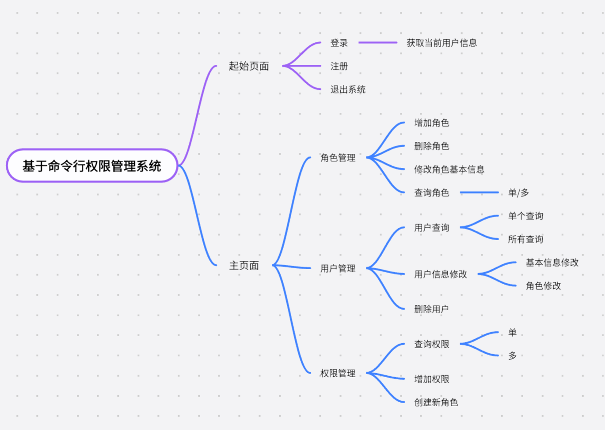
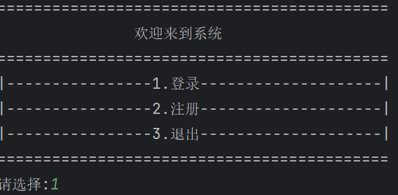
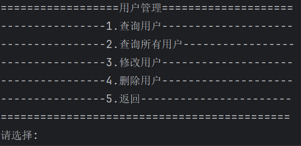
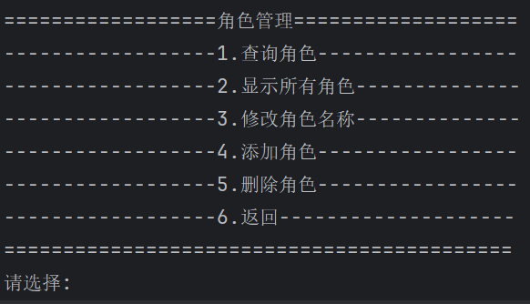
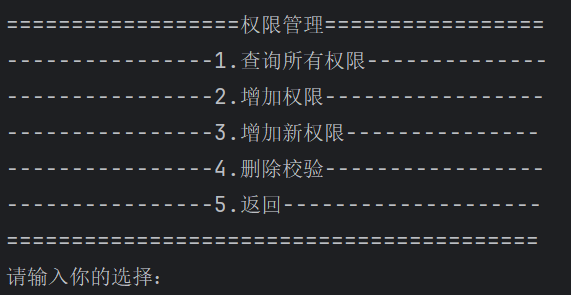
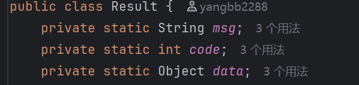
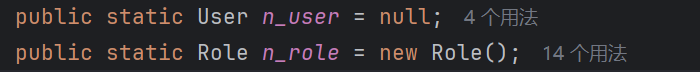
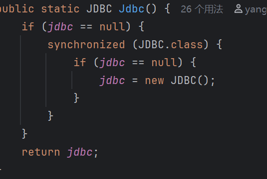
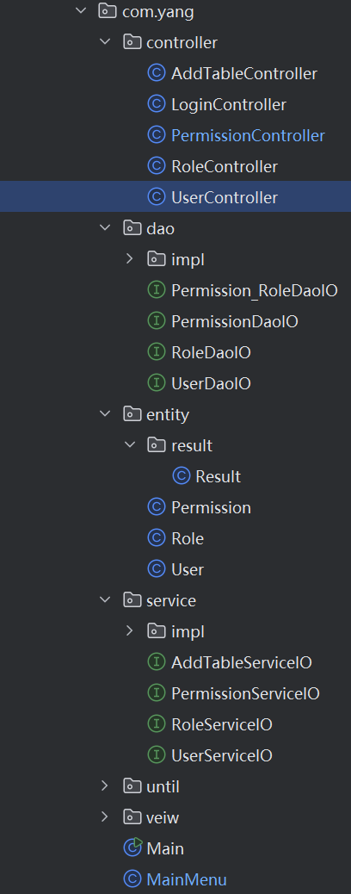
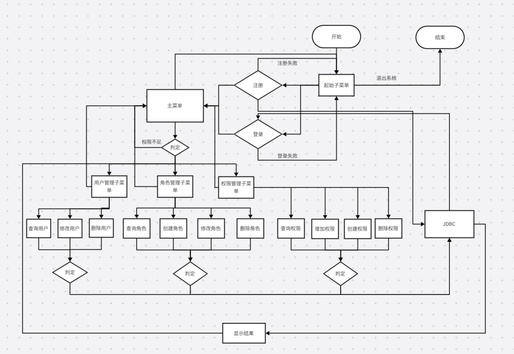

2025/11/15  
    该现程序没有完成待完善  
2025/11/17  
    将用户表与角色表连接起来，用户与角色管理功能已经实现  
2025/11/18  
    添加用户权限管理功能,将前端UI页面进行划分  
2025/11/20  
    各项功能已经基本完成。  

##一，项目背景  
在公司内部有一个系统可以管理公司员工权限，员工有相应的权限才可以访问内部一些信息，基于命令行权限管理系统居于此建立  

##二，软件功能

如上图，我们将系统划分四个UI页面，登录注册页面，用户管理页面，角色管理页面，权限管理页面：  
登录注册页面：包含登录注册内容（后续可以加入忘记密码功能），命令行如下：

用户管理页面：包含用户列表，添加用户，修改用户，删除用户，命令行如下：

角色管理页面：包含角色列表，添加角色，修改角色，删除角色，命令行如下：

权限管理页面：包含权限列表，添加权限，修改权限，删除权限，命令行如下：

##三，创新点与设计特色  
1.使用实体类Result进行统一返回输出Result（code，返回信息，返回数据）

2.在主页面实现当前用户基本信息储存,登录成功后，将用户信息储存在session中，方便后续使用  

3.将JDBC独立出来，实现一个工具类，并且将JDBC使用单例模式防止多线程并发
  

##四,设计模式使用  
(1)单例模式：创建一个单例JDBC类，保证一个类只有一个实例，并提供一个访问它的全局访问点。  
(2)分层架构：将项目分为多个，分别是表示层，控制层，业务层，数访问层，实体层。  
(3)MVC模式：将项目分为多个，分别是表示类，控制类，实体类。  
(4)工厂模式：JDBC类封装了数据库连接的创建过程。  
(5)数据传输模式：将数据传输封装成Result对象，方便传输。  
(6)接口隔离原则：将接口隔离，将接口分为多个，实现接口与实现方法分离。  

##五,程序结构
  
程序主要结构有：  
1.控制层：登录注册，用户管理，角色管理，权限管理   
2.数据访问层：Dao  
3.实体层：用户，角色，权限，（Result返回数据）  
4.业务层：业务逻辑  
5.工具类：JDBC  
7.表示层：登录注册，用户管理，角色管理，权限管理  
8.主类：Main，MainMenu(主菜单)  

##六,流程图

##七,类及其关系
后续更新